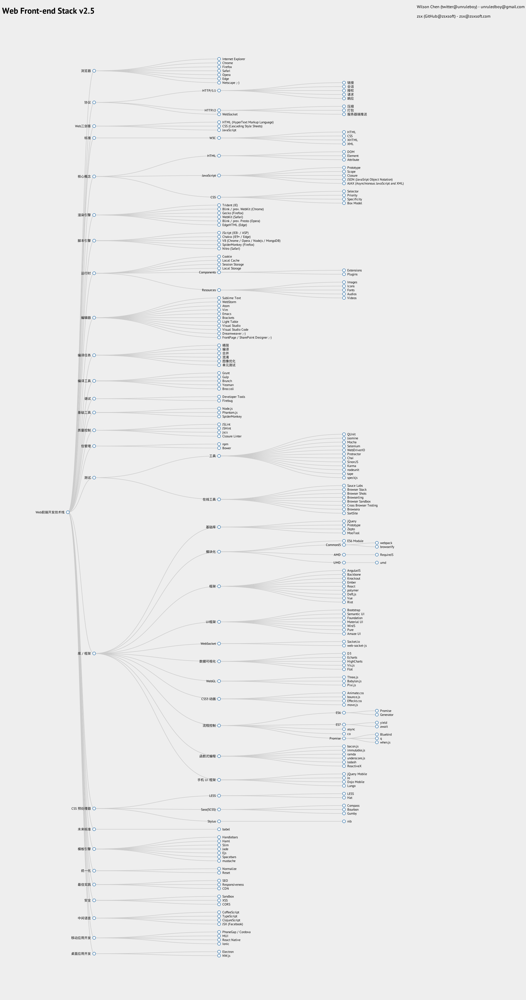

web前端整理
## WEB
* [面试数十人有感](https://yuchengkai.cn/%E9%9D%A2%E8%AF%95%E6%95%B0%E5%8D%81%E4%BA%BA%E6%9C%89%E6%84%9F/)
```
我强烈推荐 CS61 系列，如果你能将这三门课完整的学习下来也基本有大部分科班本科的素养了。
```
* [驳《慎用 try catch》](https://juejin.im/post/5c199882f265da617464c745)


## git
* [Git常用命令清单笔记](https://segmentfault.com/a/1190000002479970)

## 资源
[worldlink](http://www.worldlink.com.cn/)

## Web 前端技术图谱
* [source](https://github.com/unruledboy/WebFrontEndStack)
* 
