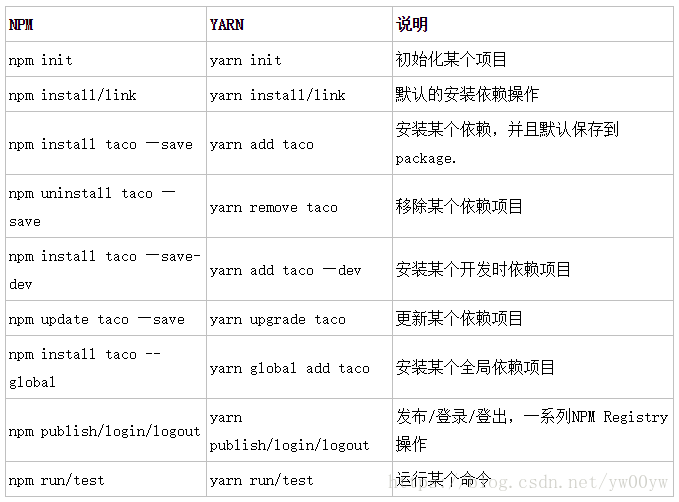

# yarn

[yarn 官网](https://yarnpkg.com/zh-Hans/docs/install#windows-stable)

## npm 和 yarn 区别

[区别](https://www.jianshu.com/p/254794d5e741)

## yarn yarn 的安装和使用

-   [yarn 的安装和使用](https://blog.csdn.net/yw00yw/article/details/81354533)
-   [Yarn 安装与使用详细介绍](https://blog.csdn.net/csdn_yudong/article/details/82015885)

```
yarn的安装:
  下载node.js，使用npm安装
  npm install -g yarn
  查看版本：yarn --version
  安装node.js,下载yarn的安装程序:
  提供一个.msi文件，在运行时将引导您在Windows上安装Yarn
  Yarn 淘宝源安装，分别复制粘贴以下代码行到黑窗口运行即可
  yarn config set registry https://registry.npm.taobao.org -g
  yarn config set sass_binary_site http://cdn.npm.taobao.org/dist/node-sass -g

```



## react yarn 安装 node-sass 过慢或报编译错误

-   [为什么 node-sass 总是安装失败？](https://segmentfault.com/a/1190000020993365?utm_source=tag-newest)

第一步：配置淘宝镜像
yarn config set registry https://registry.npm.taobao.org -g
第二步：配置下 node-sass 的二进制包镜像地址
yarn config set sass_binary_site http://cdn.npm.taobao.org/dist/node-sass -g

## nrm

-   [npm、yarn、nrm 包管理工具](https://blog.csdn.net/angong8327/article/details/101124052)

```
安装 nrm：
npm install -g nrm

列出可用源：
nrm ls

切换源：
nrm use taobao
```
